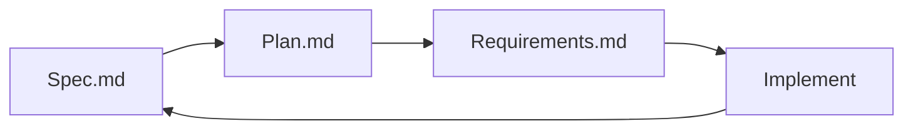

# Smart98 Demo — Spec-Driven Development

SDD-based demo project for the **Smart98** AI workspace platform. This repository is the canonical, executable specification: it defines **what** we build (spec.md), **when** we build it (plan.md), and **how we prove it is done** (requirements.md), before a single line of implementation code is written.

> Built with the **Spec-Driven Development (SDD)** methodology — spec → plan → validate → implement.

---

## 🎯 For Vibe Coding Group

A dedicated **pitch deck** has been created to showcase Smart98's capabilities — especially **MCP, Skill, and Agent** — for the vibe coding audience:

📊 **[pitch-deck/index.html](pitch-deck/index.html)** — 12-slide presentation covering:

| Slide | Topic | Highlights |
|-------|-------|-----------|
| 1 | Title | Stats: 10 runs → rules, 4 layers, 13 FRs, 0 deps |
| 2 | The Problem | Without vs With Smart98 — failure → learning loop |
| 3 | The Smart98 Loop | Goal → Agent → MCP → Skill → Engine → Human |
| 4 | Self-Evolving (LIVE) | 10 runs → 10 rules, sample rules, guarantees |
| 5 | MCP | Tool discovery, chat invocation, architecture |
| 6 | Skill | @skill-name activation, use cases, FR-003/004 |
| 7 | Agent | Autonomous execution, lifecycle, FR-005/006 |
| 8 | Workspaces | Scenario org, share links, cross-session, Labs |
| 9 | Roadmap | P1 MVP → P2 → P3 with status |
| 10 | Try It | 30-second quick start |
| 11 | SDD | Spec → Plan → Implement loop |
| 12 | Close | "Vibe coding is not magic" |

Open in browser or convert to PDF for presentation.

---

## 🚀 Quick Start

```bash
git clone https://github.com/Armoyas/smart98-demo
cd smart98-demo/goal-evolve
npm install         # only needed on Node < 22.6 (installs tsc)
npm run demo        # 10 practice runs + evolution report
npm test            # prove the engine's guarantees
```

You will see four failed runs, six successful ones, and — with nothing hardcoded — the engine derives the winning habit on its own:

```
RULE-4hnurt [planning] 100% support=6
  Read the relevant files, edit in place, then run the tests
  Observed in 6 run(s), 6 of which achieved the goal (100% success rate).
  evidence: RUN-5, RUN-6, RUN-7, RUN-8, RUN-9, RUN-10
```

Then open `dashboard/index.html` in a browser for the visual version: stat cards, run trace, evidence-backed rules, and the four Smart98 rule layers with blank-layer detection.

### Node version support

`npm run demo` works on **Node 18 and newer**. The launcher (`run.mjs`) detects what your Node can do:

| Node version | What happens |
| --- | --- |
| **22.6+** | TypeScript sources run directly via native type stripping. No build step. |
| **18 – 22.5** | Compiles once with `tsc` into `dist/`, then runs the JavaScript. Requires `npm install`. |

Either way the command is the same. `run.mjs` prints which path it took.

<details>
<summary><b>Got <code>node: bad option: --experimental-strip-types</code>?</b></summary>

Your Node is older than 22.6, so that flag does not exist. Two options:

**Option A — install the build dependency (recommended):**

```bash
cd goal-evolve
npm install     # installs typescript
npm run demo    # run.mjs compiles to dist/ and runs it
```

**Option B — upgrade Node:**

```bash
nvm install 22 && nvm use 22
npm run demo    # now runs the TS sources directly, no build
```

Check your version with `node --version`.

</details>

---

## 🖥️ Dashboard Server

The dashboard (`goal-evolve/dashboard/index.html`) includes a **"Run embedded demo"** button that invokes the live engine via the local server.

### Start the server

```bash
cd smart98-demo/goal-evolve
npm run serve        # now /api/run will work
```

Then open **http://localhost:3000** in your browser.

### What the server provides

| Endpoint | Description |
| --- | --- |
| `/` | Serves the dashboard HTML |
| `/api/run` | Runs 10 practice runs via the engine, returns live JSON |
| `/api/status` | Returns `{status: "ready", snapshotExists, snapshot}` |
| `/snapshot.json` | Latest snapshot file |

The dashboard button fetches `/api/run` with a loading animation, and falls back to embedded demo data if the server is unavailable.

### Full server setup (if issues occur)

```bash
rm -rf dist
pkill -f "node server.mjs" || true
git pull origin
npm run serve
```

This sequence:
1. **`rm -rf dist`** — removes stale compiled output (old `dist/` may be missing newer test JS files)
2. **`pkill -f "node server.mjs"`** — stops any running server instance
3. **`git pull origin`** — fetches the latest code
4. **`npm run serve`** — starts the fresh server at `http://localhost:3000`

---

## 🧠 Why this demo (for the Vibe Coding group)

The demo exercises two Smart98 capabilities end-to-end:

| Capability | What it means | Where |
| --- | --- | --- |
| **Goal** | A unit of intent with *explicit acceptance criteria* — a contract, not a prompt. Enforced state machine: `open → running → achieved / blocked / abandoned`. | [`goal-evolve/src/goal.ts`](goal-evolve/src/goal.ts) |
| **Self-Evolving** | The platform observes agent practice and mines rules: success n-gram habits + failure-cluster recovery rules. Every rule carries its evidence; candidates need human approval. | [`goal-evolve/src/evolve.ts`](goal-evolve/src/evolve.ts) |

Engine guarantees (all test-enforced):

1. **Deterministic** — same practice in, same rules out. No sampling, no model call.
2. **Evidence-backed** — every rule cites the runs that produced it.
3. **Conservative** — a rule needs ≥ 3 independent runs (configurable `minSupport`).
4. **Non-trivial** — patterns present in *every* run are rejected as noise.
5. **Idempotent** — evolving twice never duplicates suggestions.

Presenting live? [`goal-evolve/DEMO_SCRIPT.md`](goal-evolve/DEMO_SCRIPT.md) is a 4-minute talk track with beats and Q&A ammunition.

**Success criterion check (SC-006):** 10 practice runs → ≥ 1 non-trivial rule. The CLI exits non-zero if this ever fails.

---

## 📁 Repository layout

```
smart98-demo/
├── docs/
│   ├── spec.md              user stories, FR-001…FR-013, SC-001…SC-008
│   ├── plan.md              10 implementation steps with test criteria
│   └── requirements.md      validation checklist / SDD gates
│
├── goal-evolve/             ← the runnable demo
│   ├── run.mjs              universal launcher (Node 18+)
│   ├── server.mjs           HTTP server for dashboard (/api/run, /api/status)
│   ├── src/
│   │   ├── types.ts         Goal, Run, Rule, Observation, RuleLayer
│   │   ├── store.ts         append-only JSONL event log; state by reduction
│   │   ├── goal.ts          goal state machine + transition table
│   │   ├── evolve.ts        the two miners (habits + recoveries)
│   │   ├── engine.ts        wires runGoal() → Observation → evolveNow() → Rule[]
│   │   └── demo.ts          the 10-run practice scenario
│   ├── bin/demo.ts          CLI: colored report, --json, exit code = SC-006
│   ├── test/
│   │   ├── engine.test.ts   17 tests over the five guarantees
│   │   ├── domain.test.ts   domain entity tests
│   │   └── goal-dialog.test.ts  goal creation dialog tests
│   ├── dashboard/
│   │   └── index.html       single-file visual dashboard + server wiring
│   └── DEMO_SCRIPT.md       4-minute talk track
│
├── pitch-deck/              ← vibe coding presentation
│   └── index.html           12-slide deck (MCP, Skill, Agent, Self-Evolving, Roadmap)
│
└── README.md                ← this file
```

---

## 📚 Documents

| Document | Path | Purpose |
| --- | --- | --- |
| Feature Specification | [`docs/spec.md`](docs/spec.md) | User stories, functional requirements (FR-001…FR-013), success criteria (SC-001…SC-008), Given-When-Then scenarios |
| Implementation Plan | [`docs/plan.md`](docs/plan.md) | 10 steps over ~7.5 days, tasks, file lists, testing criteria, progress tracking |
| Validation Checklist | [`docs/requirements.md`](docs/requirements.md) | Spec quality, technical completeness, SDD alignment, feature coverage, open items |

---

## 🎯 Scope (P1 MVP)

1. **MCP** — tool discovery & chat invocation
2. **Skill** — definition & activation via `@skill-name`
3. **Agent** — custom agents with autonomous execution
4. **Project Workspaces** — scenario organization

**P2:** Self-Evolving, Artifact Deployment · **P3:** Eval cases, Markdown rendering, text selection, OAuth Apps

> **goal-evolve** (`goal-evolve/`) implements the P2 *Self-Evolving* slice (FR-009 / SC-006) plus the goal lifecycle, as a standalone runnable module.

---

## 🧭 SDD Workflow



1. **Specify** — capture intent as user stories + FR + SC
2. **Plan** — break into tracked steps with test criteria
3. **Validate** — checklist gates before implementation
4. **Implement** — fork/track upstream, build step-by-step

---

## 🚧 Status

- [x] Feature specification
- [x] Implementation plan
- [x] Validation checklist
- [x] `goal-evolve` — Goal + Self-Evolving engine, CLI, dashboard, tests, demo script, server
- [x] `pitch-deck` — Vibe coding presentation deck
- [ ] Remaining implementation (MCP, Skill, Agent, Workspaces — per plan.md)

---

## 🔗 Upstream

- `lobehub/lobe-chat` — main fork target (MCP marketplace built-in)
- Casdoor auth at `auth.smart98.ir` — confirmed working
