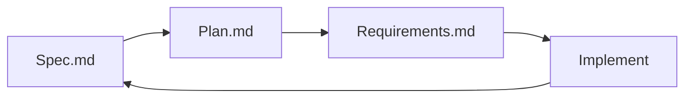

# Smart98 Demo — Spec-Driven Development

SDD-based demo project for the **Smart98** AI workspace platform. This repository is the canonical, executable specification: it defines **what** we build (spec.md), **when** we build it (plan.md), and **how we prove it is done** (requirements.md), before a single line of implementation code is written.

> Built with the **Spec-Driven Development (SDD)** methodology — spec → plan → validate → implement.

---

## ⚡ Run it in 30 seconds

The **goal-evolve** demo is the fastest way to feel Smart98: a goal with acceptance criteria, an agent that practices, and a self-evolving engine that mines rules from that practice — deterministically, with zero runtime dependencies.

```bash
git clone https://github.com/Armoyas/smart98-demo
cd smart98-demo/goal-evolve
npm run demo        # 10 practice runs + evolution report
npm test            # prove the engine's guarantees
```

You will see four failed runs, six successful ones, and — with nothing hardcoded — the engine derives the winning habit on its own:

```
RULE-xxxx [verification] 100% support=6
  Read the relevant files, then edit in place, then run the tests
  Observed in 6 run(s), 6 of which achieved the goal (100% success rate).
  evidence: RUN-5, RUN-6, RUN-7, RUN-8, RUN-9, RUN-10
```

Then open `dashboard/index.html` in a browser for the visual version: stat cards, run trace, evidence-backed rules, and the four Smart98 rule layers with blank-layer detection.

---

## 🧠 Why this demo (for the Vibe Coding group)

The demo exercises two Smart98 capabilities end-to-end:

| Capability | What it means | Where |
| --- | --- | --- |
| **Goal** | A unit of intent with *explicit acceptance criteria* — a contract, not a prompt. Enforced state machine: `open → running → achieved / blocked / abandoned`. | [`goal-evolve/src/goal.ts`](goal-evolve/src/goal.ts) |
| **Self-Evolving** | The platform observes agent practice and mines rules: success n-gram habits + failure-cluster recovery rules. Every rule carries its evidence; candidates need human approval. | [`goal-evolve/src/evolve.ts`](goal-evolve/src/evolve.ts) |

Engine guarantees (all test-enforced):

1. **Deterministic** — same practice in, same rules out. No sampling, no model call.
2. **Evidence-backed** — every rule cites the runs that produced it.
3. **Conservative** — a rule needs ≥ 3 independent runs (configurable `minSupport`).
4. **Non-trivial** — patterns present in *every* run are rejected as noise.
5. **Idempotent** — evolving twice never duplicates suggestions.

Presenting live? [`goal-evolve/DEMO_SCRIPT.md`](goal-evolve/DEMO_SCRIPT.md) is a 4-minute talk track with beats and Q&A ammunition.

**Success criterion check (SC-006):** 10 practice runs → ≥ 1 non-trivial rule. The CLI exits non-zero if this ever fails.

---

## 📚 Documents

| Document | Path | Purpose |
| --- | --- | --- |
| Feature Specification | [`docs/spec.md`](docs/spec.md) | User stories, functional requirements (FR-001…FR-012), success criteria (SC-001…SC-008), Given-When-Then scenarios |
| Implementation Plan | [`docs/plan.md`](docs/plan.md) | 10 steps over ~7.5 days, tasks, file lists, testing criteria, progress tracking |
| Validation Checklist | [`docs/requirements.md`](docs/requirements.md) | Spec quality, technical completeness, SDD alignment, feature coverage, open items |

---

## 🎯 Scope (P1 MVP)

1. **MCP** — tool discovery & chat invocation
2. **Skill** — definition & activation via `@skill-name`
3. **Agent** — custom agents with autonomous execution
4. **Project Workspaces** — scenario organization

**P2:** Self-Evolving, Artifact Deployment · **P3:** Eval cases, Markdown rendering, text selection, OAuth Apps

> **goal-evolve** (`goal-evolve/`) implements the P2 *Self-Evolving* slice (FR-009 / SC-006) plus the goal lifecycle, as a standalone runnable module.

---

## 🧭 SDD Workflow



1. **Specify** — capture intent as user stories + FR + SC
2. **Plan** — break into tracked steps with test criteria
3. **Validate** — checklist gates before implementation
4. **Implement** — fork/track upstream, build step-by-step

---

## 🚧 Status

- [x] Feature specification
- [x] Implementation plan
- [x] Validation checklist
- [x] `goal-evolve` — Goal + Self-Evolving engine, CLI, dashboard, tests, demo script
- [ ] Remaining implementation (MCP, Skill, Agent, Workspaces — per plan.md)

---

## 🔗 Upstream

- `lobehub/lobe-chat` — main fork target (MCP marketplace built-in)
- Casdoor auth at `auth.smart98.ir` — confirmed working
