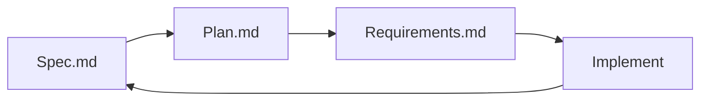

# Smart98 Demo — Spec-Driven Development

SDD-based demo project for the **Smart98** AI workspace platform. This repository is the canonical, executable specification: it defines **what** we build (spec.md), **when** we build it (plan.md), and **how we prove it is done** (requirements.md), before a single line of implementation code is written.

> Built with the **Spec-Driven Development (SDD)** methodology — spec → plan → validate → implement.

---

## 📚 Documents

| Document | Path | Purpose |
| --- | --- | --- |
| Feature Specification | [`docs/spec.md`](docs/spec.md) | User stories, functional requirements (FR-001…FR-012), success criteria (SC-001…SC-008), Given-When-Then scenarios |
| Implementation Plan | [`docs/plan.md`](docs/plan.md) | 10 steps over ~7.5 days, tasks, file lists, testing criteria, progress tracking |
| Validation Checklist | [`docs/requirements.md`](docs/requirements.md) | Spec quality, technical completeness, SDD alignment, feature coverage, open items |

---

## 🎯 Scope (P1 MVP)

1. **MCP** — tool discovery & chat invocation
2. **Skill** — definition & activation via `@skill-name`
3. **Agent** — custom agents with autonomous execution
4. **Project Workspaces** — scenario organization

**P2:** Self-Evolving, Artifact Deployment · **P3:** Eval cases, Markdown rendering, text selection, OAuth Apps

---

## 🧭 SDD Workflow

1. **Specify** — capture intent as user stories + FR + SC
2. **Plan** — break into tracked steps with test criteria
3. **Validate** — checklist gates before implementation
4. **Implement** — fork/track upstream, build step-by-step

---

## 🚧 Status

- [x] Feature specification
- [x] Implementation plan
- [x] Validation checklist
- [ ] Implementation (Step 1: repo fork & setup)

---

## 🔗 Upstream

- `lobehub/lobe-chat` — main fork target (MCP marketplace built-in)
- Casdoor auth at `auth.smart98.ir` — confirmed working
